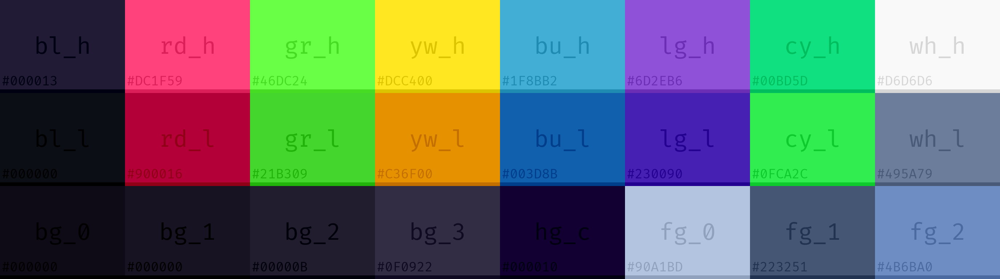

# [Zoh-j02r](https://github.com/Zoh-j02r) dotfiles
Dotfiles are how you can customize your system once and keep you from reconfiguring everything every time you get a new computer or format one. These are my dotfiles for multipurpose tasks, with scripts written mostly with shell scripting and `Lua`, focused on minimalism for my `Void Linux` system.
#### About this repo
My take on a minimalist system is that there must be low overhead, small programs must be used. There is no need for many applications since the great ones can achieve the same functionality. With that said, I have the goal to make a working system following this minimalism principle. I decided to use mostly `Wayland` applications since most dependencies cycles around `GTK`, so no cool looking rounded-blurry-transparent stuff here.
#### Software used
- Terminal: [foot](https://codeberg.org/dnkl/foot)
- WM: [sway](https://github.com/swaywm/sway)
- Text Editor: [neovim](https://neovim.io/charter/)
- Bar: [yambar](https://codeberg.org/dnkl/yambar)
- PDF reader: [zathura](https://pwmt.org/projects/zathura/)
- Browser: [luakit](https://luakit.github.io/)
- Screen locking: [swaylock](https://github.com/swaywm/swaylock)
- Image viewer: [imv](https://sr.ht/~exec64/imv/)
#### Screenshots
#### Palette

#### Scripts
I made a script named palette responsible for syncing the colorscheme of system. The command below change a specific color from all programs
```
$ palette set <colorscheme> <color-id> <hexcode> 
```

#### License
The code is available under the [MIT license](LICENSE).
